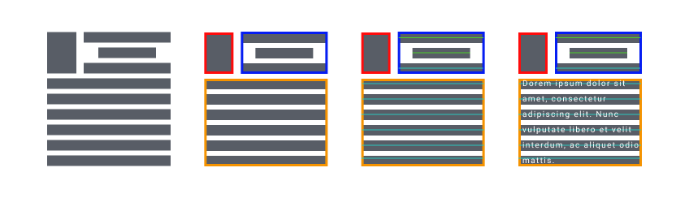
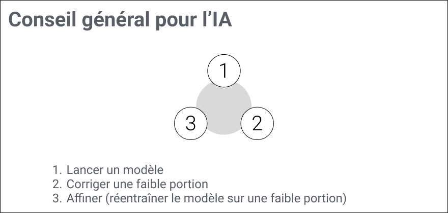
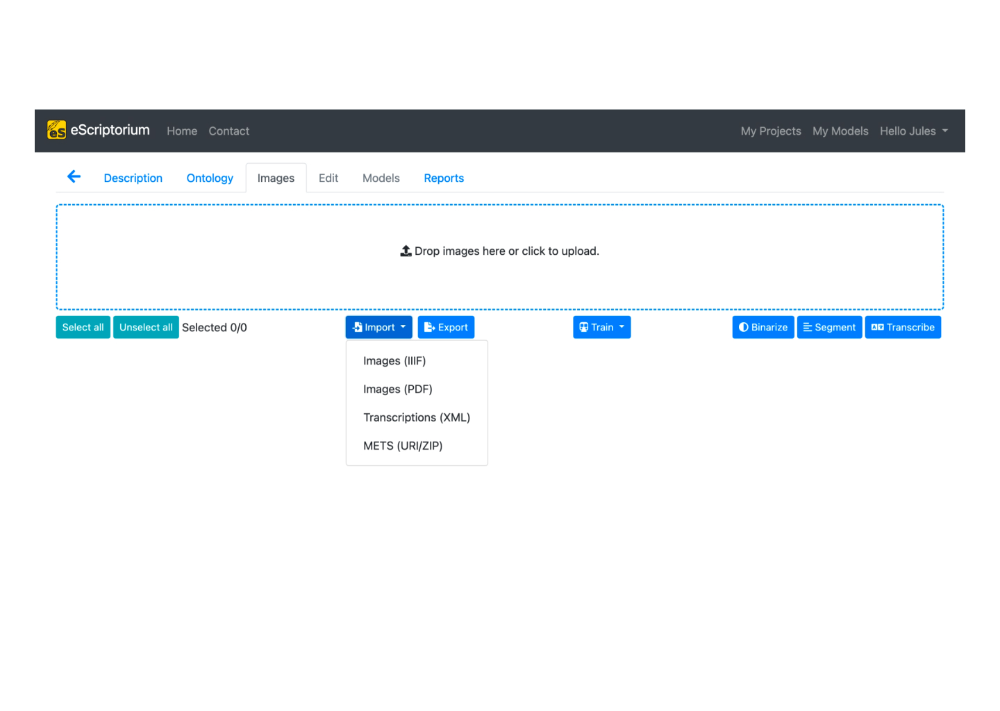
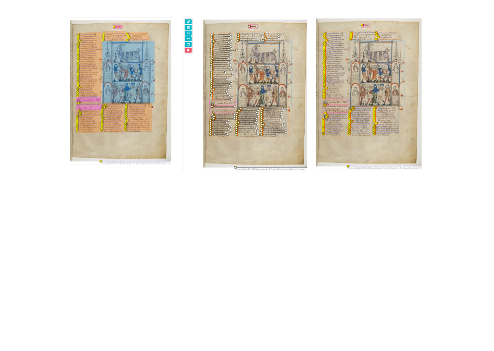
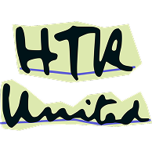
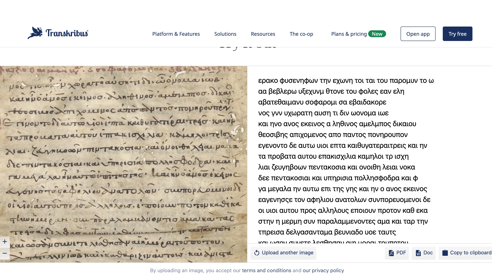

# La Transcription


- Récupérer des images
- Segmentation des images et catégorisation des zones
- Segmentation et catégorisation des lignes
- Reconnaissance de l’écriture



---


## Récupérer des images

> ### **IIIF**
> 
> 
>
> **Description** : Standard d’interrogation des images sous forme d’une API
>  
> **Lien** : [iiif.io](https://iiif.io/)

[Tutoriel](https://www.dotporterdigital.org/how-to-download-images-using-iiif-manifests-part-i-downthemall/) pour récupérer des images a partir d'un manifest IIIF


---
## Segmentation des images et catégorisation des zones

> ### **YALTAi**
> 
>
>
> **Description** : Outil pour détecter des zones de l’image compatible avec l’outil Kraken
>  
> **Lien** : [YALTAi](https://pypi.org/project/YALTAi/)

> ### **SegmOnto**
> 
>
>
> **Description** : Vocabulaire controlé pour décrire des zones de l’image de manière générique
>  
> **Lien** : [Segmonto](https://segmonto.github.io/)


**Pourquoi traiter les zones de l’image ?**
- Nettoyage du bruit ex: note des numéros de folio
- Débuter une sémantisation
  
## Reconnaissance automatique de texte (RAT ou ATR) 


> ### **Kraken**
> 
> 
>  
> **Lien** : [kraken.re](https://kraken.re/main/index.html)
>
> **usage**:
>```kraken -a -i bw.tif image.txt segment -bl ocr```


> ### **E-Scriptorium**
> 
> 
>
>  
> **Lien** : [escriptorium](https://escriptorium.paris.inria.fr/)
>
> **note**:
> demande de compte [ici](https://cremmacall.sciencescall.org/)






#### Sortie Alto
```xml
<TextLine id="eSc_line_f515ee32" custom="structure {type:default;}">
    <Coords points="1419,2066 1419,2079 1846,2075 1847,2062 1845,2043 1718,2033 1717,2033 1715,2033 1686,2043 1581,2034 1579,2034 1578,2034 1557,2044 1486,2036 1485,2036 1418,2045 1419,2066"/>
    <Baseline points="1419,2066 1847,2062"/>
    <TextEquiv conf="0.976439884415379">
        <Unicode>ariathiari. ciuitas saltuũ</Unicode>
    </TextEquiv>
</TextLine>
```

#### Sortie PageXml
```xml
<TextLine ID="eSc_line_d461912b" 
          BASELINE="2474 2174 2891 2179" 
          HPOS="2471" 
          VPOS="2145" 
          WIDTH="419" 
          HEIGHT="59">
    
    <Shape>
        <Polygon POINTS="2473 2172 2471 2204 2888 2204 2890 2177 2888 2145 2473 2145 2473 2172"/>
    </Shape>
    
    <String CONTENT="sfane equorũ domitor" 
            HPOS="2471" 
            VPOS="2145" 
            WIDTH="419" 
            HEIGHT="59" 
            WC="0.965121777284713"/>
    
</TextLine>
```

Où trouver des modèles : 
> ### **HTR United**
> 
> 
>
>  
> **Lien** : [htr-united.github.io](https://htr-united.github.io/)

Model Latin conseillé:
https://zenodo.org/records/12743230

> ### **Transkribus**
> 
> 
>
>  
> **Lien** : [Transkribus](https://readcoop.eu/transkribus/)



<div style="background:#a8f7ef;color:#62918d;padding:10px">
 
 ### Manipulation rapide :
 - https://www.transkribus.org/model/greek-ancient-majuscule-spaced
 - https://www.transkribus.org/model/greek_medieval-and-modern-minuscule
 - https://huggingface.co/spaces/wjbmattingly/medieval-htr-page

</div>

---
## OCR

> ### **OCR4ALL**
> 
> **Lien** : [escriptorium](https://escriptorium.paris.inria.fr/)
>

> ### **Tesseract OCR**
> 
> **Lien** : [escriptorium](https://escriptorium.paris.inria.fr/)
>

---
## Apprendre la Paléographie

> ### **Multi Pal**
>  
> **Lien** : [www.multipal.fr](https://www.multipal.fr/fr/welcome/)

> ### **DigiPal**
>  
> **Lien** : [digipal](https://github.com/kcl-ddh/digipal)

